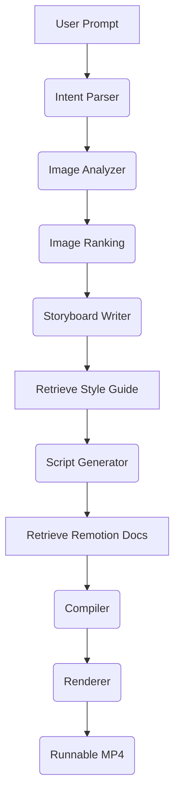

# 🎬 FotoOwl AI Pipeline

An AI-powered multi-agent pipeline that converts a collection of images into a **runnable MP4 video** using LangGraph, Google Gemini, ChromaDB (RAG), and Remotion.

The system analyzes uploaded images, understands the user's intent, selects the most relevant images, generates a storyboard, creates a Remotion composition, validates the generated script, and renders the final MP4 video.

---

# Demo Pipeline

```
User Prompt
      │
      ▼
Intent Parser
      │
      ▼
Image Analyzer
(Batch Gemini Vision)
      │
      ▼
Image Ranking
      │
      ▼
Storyboard Writer
      │
      ▼
Script Generator
(Remotion TSX)
      │
      ▼
Compiler & Validator
      │
      ▼
Renderer
(Remotion)
      │
      ▼
Runnable MP4 Video
```

---

# Features

- Multi-Agent Workflow using LangGraph
- Natural Language Intent Parsing
- Batch Image Analysis using Gemini Vision
- AI-based Image Ranking
- Automatic Image Selection
- Storyboard Generation
- Retrieval-Augmented Generation (ChromaDB)
- Remotion Composition Generation
- Script Validation
- MP4 Video Rendering
- JSON Pipeline Trace Generation

---

# Setup

## Clone Repository

```bash
git clone https://github.com/<username>/fotoowl-ai-pipeline.git

cd fotoowl-ai-pipeline
```

---

## Install Python Dependencies

```bash
pip install -r requirements.txt
```

---

## Install Node Dependencies

```bash
npm install
```

---

## Create .env

```
GEMINI_API_KEY=YOUR_API_KEY
```

---

## Run Pipeline

```
python main.py
```

---

## Render Video

```
npx remotion render remotion/index.ts WeddingVideo output/final_video.mp4
```

---

# LangGraph Graph Diagram



---

# AI Agents

## Intent Parser

Converts a natural language prompt into structured video intent.

Output

- Video Style
- Mood
- Duration
- Transition
- Music Style

Model

Gemini 2.5 Flash

---

## Image Analyzer

Analyzes uploaded images using Gemini Vision.

Extracts

- Description
- Mood
- Quality Score
- Importance Score

Images are processed in batches to reduce API calls.

Model

Gemini 2.5 Flash Vision

---

## Storyboard Writer

Creates a structured storyboard by combining

- User Intent
- Image Analysis
- Retrieved Style Guide

Output

- Scene Number
- Duration
- Caption
- Transition

---

## Script Generator

Generates a runnable Remotion TypeScript composition from the generated storyboard.

Uses retrieved Remotion documentation from ChromaDB to build the composition.

Output

```
output/remotion.tsx
```

---

## Compiler & Validator

Validates the generated Remotion composition before rendering.

Compilation errors are captured and can be retried within the workflow.

---

## Renderer

Renders the generated Remotion composition into a runnable MP4 video.

Output

```
output/final_video.mp4
```

---

# Model Selection Rationale

## Gemini 2.5 Flash

Used for

- Intent Parsing
- Image Analysis

Reason

- Native multimodal support
- Fast inference
- Reliable structured JSON output
- Cost efficient

---

## LangGraph

Used for

- Multi-agent orchestration

Reason

- Explicit state management
- Modular workflow
- Retry support
- Easy debugging

---

## ChromaDB

Used for

- Retrieval-Augmented Generation

Reason

- Lightweight vector database
- Local storage
- Fast semantic retrieval

---

## Remotion

Used for

- Video composition
- MP4 rendering

Reason

- React-based rendering
- Timeline control
- Easy programmatic video generation

---

# RAG Design Decisions

Two ChromaDB collections are used.

## Style Guide Collection

Contains

- Cinematic
- Corporate
- Upbeat

Purpose

Retrieve editing style guidance while generating the storyboard.

---

## Remotion Documentation Collection

Contains

- Img
- Sequence
- Composition

Purpose

Provide Remotion examples while generating TSX code.

---

## Chunking Strategy

Documents are chunked by logical sections instead of fixed token sizes.

Example

- One chunk per animation
- One chunk per component
- One chunk per example

---

## Retrieval Strategy

- SentenceTransformer embeddings
- Top-k semantic similarity search

Retrieved context is injected into the corresponding LangGraph node.

---

# Folder Structure

```
fotoowl-ai-pipeline/

agents/
graph/
models/
services/
remotion/
rag/
tests/
public/
data/
output/

main.py
requirements.txt
package.json
README.md
.env.example
```

---

# Sample Output

The repository contains

```
output/

storyboard.json
pipeline_state.json
remotion.tsx
final_video.mp4
```

---

# Testing

Run

```
pytest
```

The tests use mocked responses and do not require API keys.

---

# Known Limitations

Current implementation

- Creates videos from still images using Remotion.
- Does not generate AI motion within individual images.
- Scene durations are fixed.
- Background music is optional.
- Image ranking is performed per processing batch before global selection.

With more time I would

- Integrate image-to-video generation models (e.g. Veo, Runway, Kling, Luma).
- Generate dynamic scene durations.
- Add automatic voice-over.
- Add subtitle generation.
- Improve transition planning.
- Add automatic background music recommendation.

---

# Tech Stack

Backend

- Python
- LangGraph
- Pydantic

AI

- Google Gemini 2.5 Flash
- ChromaDB
- Sentence Transformers

Video

- React
- Remotion
- TypeScript

---

# Author

**Shubham Dhumal**