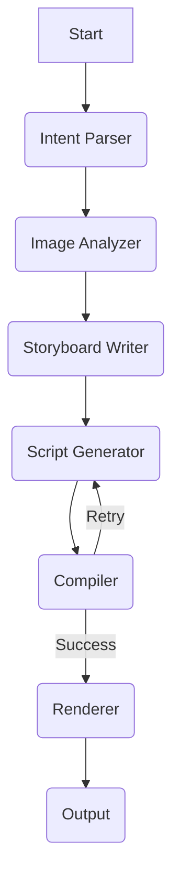

```mermaid
graph TD

A[Start]

A --> B(Intent Parser)

B --> C(Image Analyzer)

C --> D(Storyboard Writer)

D --> E(Script Generator)

E --> F(Compiler)

F -->|Success| G(Renderer)

F -->|Retry| E

G --> H(Output)
```